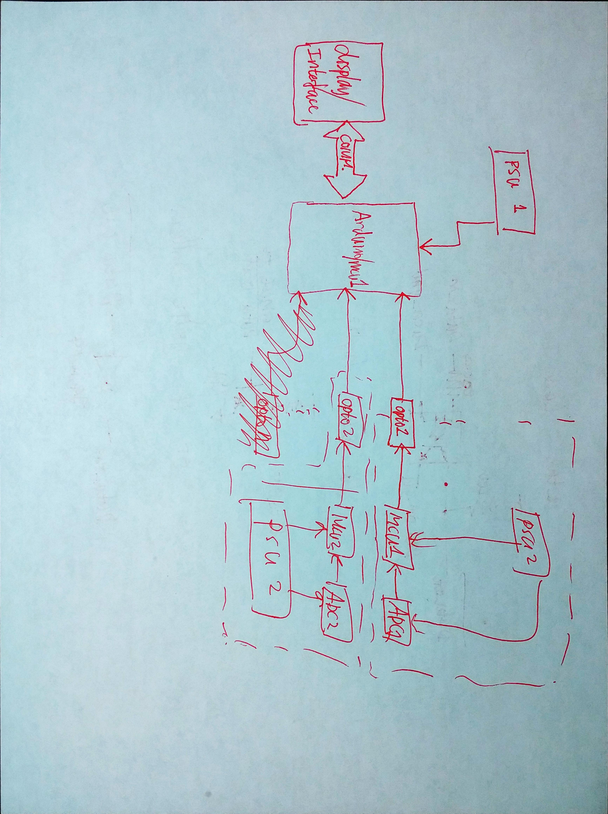
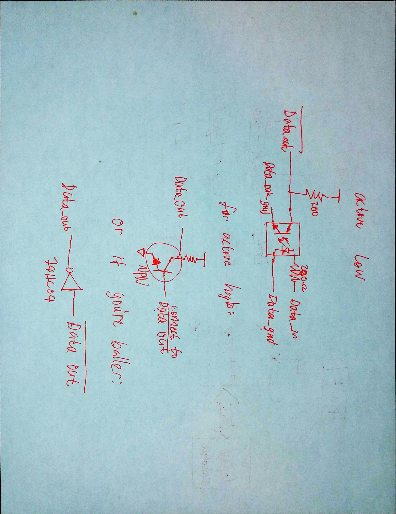

# ArduinoVoltmeterV2
Voltmeter with two isolated ADC channels
Everything has a learning curve, doesn't it? V1 fried ADCs in no time, so that's a no go. This version should solve that problem by isolating the two channels.
# Schematic

opto isolation communication:
I wrote a communication protocol, https://github.com/joesphan/OneWireCommunication , to allow one way communication through an opto isolator. The circuit used is below:

